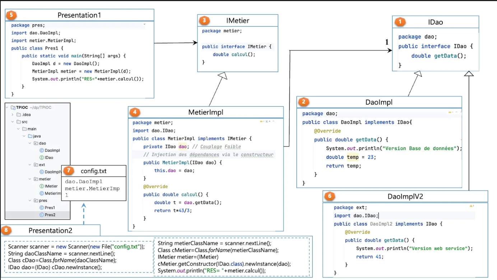
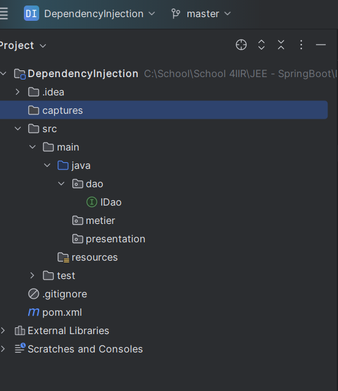
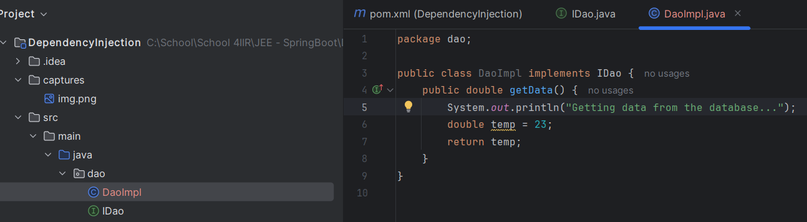
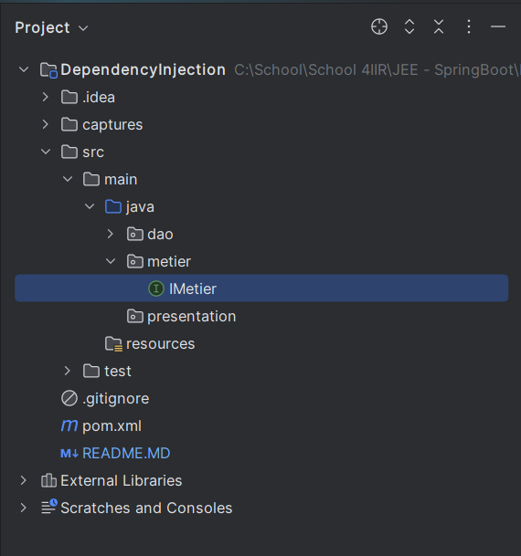
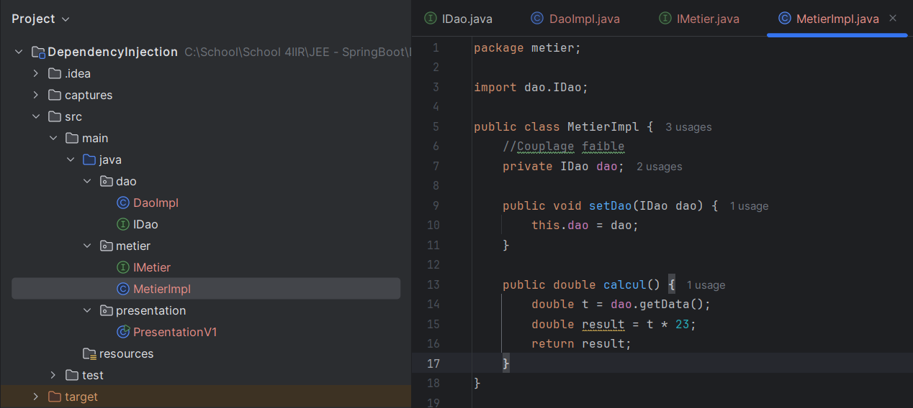
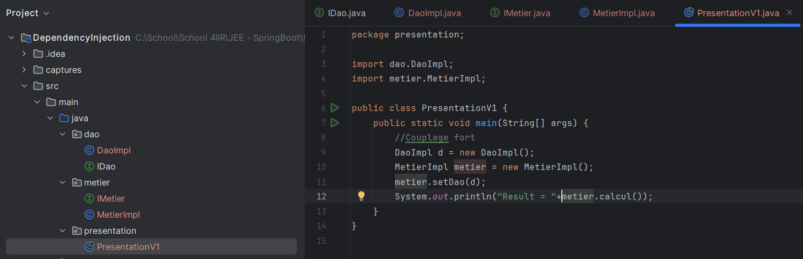
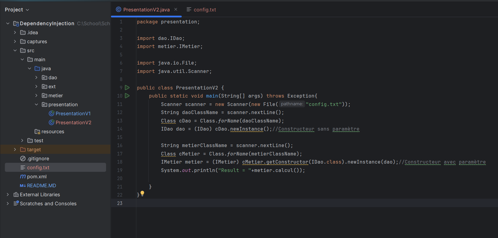

<h1>Diagramme à réaliser</h1>

<h3>1. Créer l'interface IDao avec une méthode getData</h3>

<h3>2. Créer une implémentation de cette interface </h3>

<h3>3. Créer l'interface IMetier avec une méthode calcul </h3>

<h3>4. Créer une implémentation de cette interface en utilisant le couplage faible</h3>

<h3>5. Faire l'injection des dépendances :
  a. Par instanciation statique</h3>

<h3>b. Par instanciation dynamique</h3>
